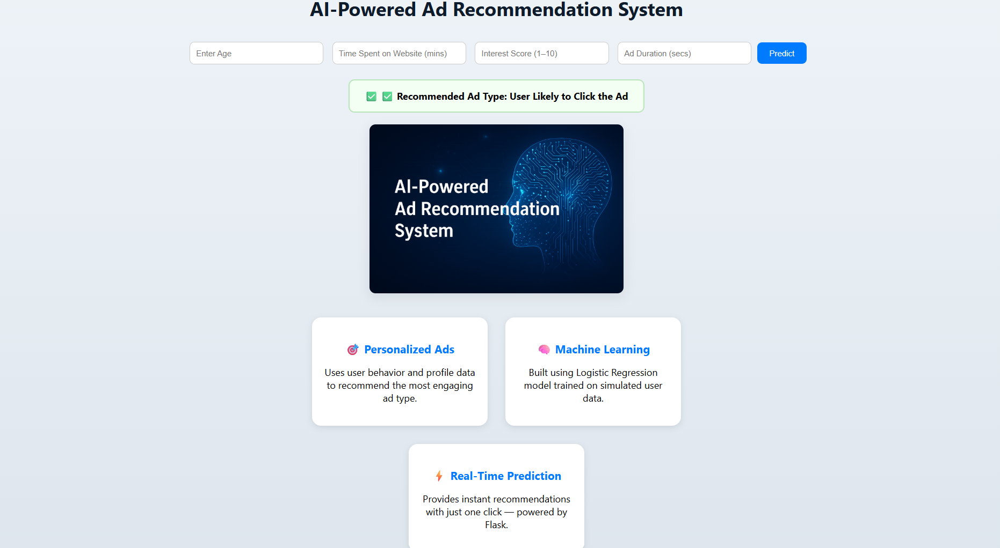

# 🧠 AI Ad Recommendation System

This is a **Flask-based AI-powered Ad Recommendation System** that predicts and displays relevant advertisements based on user preferences and engagement data.  
The project demonstrates how machine learning can personalize ad content dynamically.

---

## 🚀 Features
- AI-driven ad selection and recommendation
- Responsive Flask web interface
- Static ad banner with real image
- Simple ML model for demonstration
- Clean UI built with HTML & CSS

---

## 🛠️ Tech Stack
- **Backend:** Python, Flask  
- **Frontend:** HTML, CSS  
- **ML/AI:** Scikit-learn / TensorFlow (demo model)  
- **Others:** Pandas, NumPy

---

## 🖥️ Project Output

Here’s how the web interface looks when running locally:



---

## 🚀 How to Run Locally

1. Clone the repository:
   ```bash
   git clone https://github.com/NileshGupta123/AI-Ad-Recommendation.git

